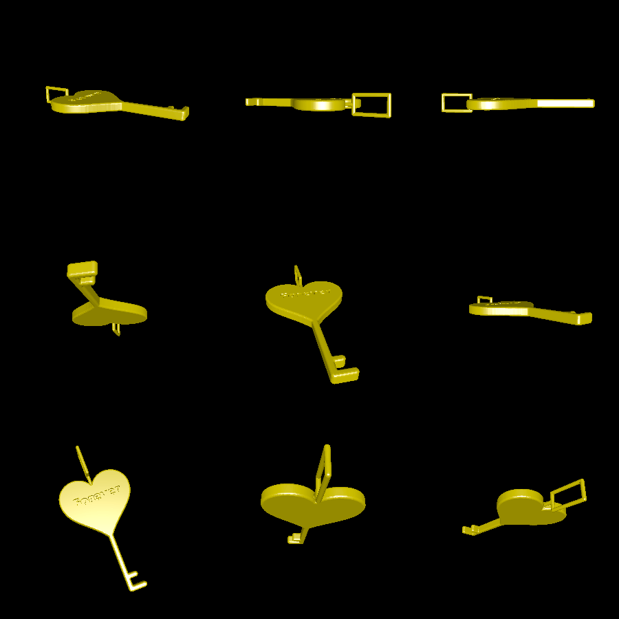

# pendant

Create custom pendants to 3D print in metal and put on a necklace.

# Renderings

Here's an example of running this command:

```
$ go run . -image examples/love_key.png -engraving examples/love_key_engraving.png
```


