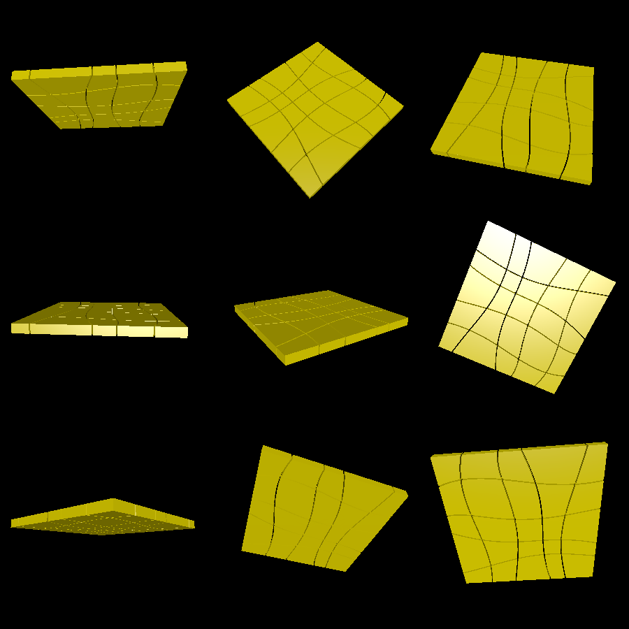
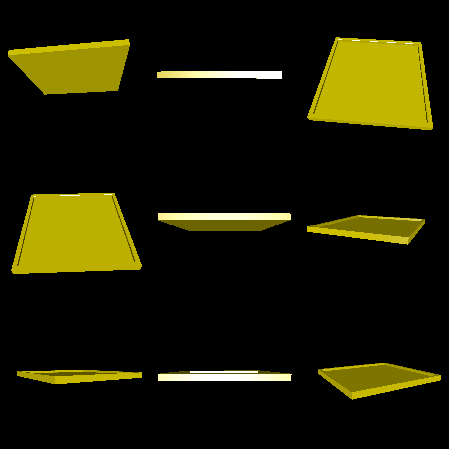

# jigsaw

This is a jigsaw puzzle with a board to hold the pieces in place. It includes a tool to slice up an image so that you can print it out, cut it out, and tape the pieces of paper to the jigsaw pieces.

# Renderings

Here are the pieces, as they would print out and fit into the board:

And here is the holder:

