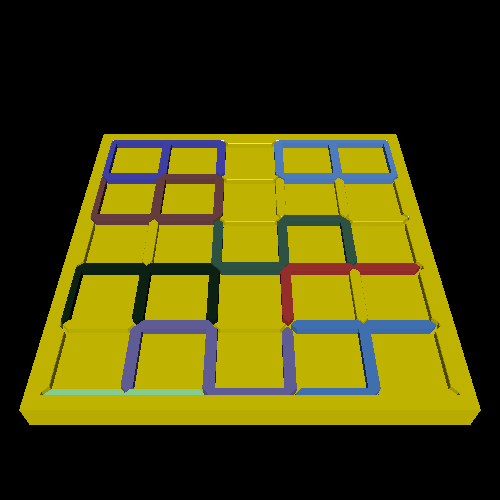

# number-puzzle

This is a puzzle that consists of digital clock style numbers that fit neatly into a grid. Search is used to solve for a board that can be solved.

# Renderings

Here is a rendering where the digit pieces are a different color from the (yellow) board:

