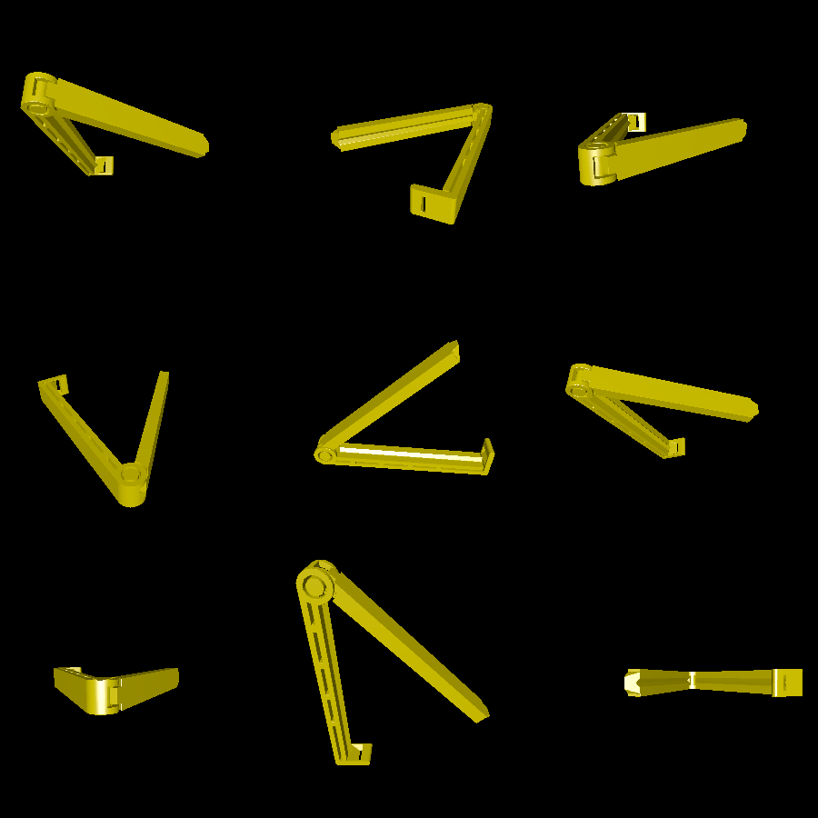

# chip-clip

This is a bag clip with a hinge that can be printed in-place without supports.
It's very similar to [this](https://www.thingiverse.com/thing:330151) model on
Thingiverse.

I've been using it for opened bags of food (frozen vegetables, chips, etc), as
well as to seal a trash bag that's been delegated for used cat litter. Some
pictures:

# Renderings

