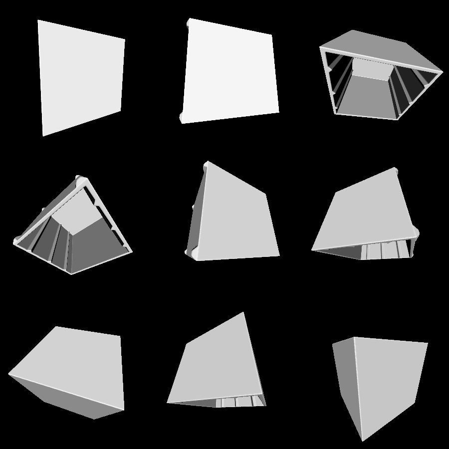
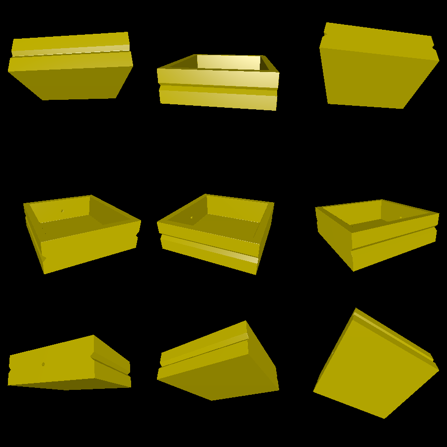
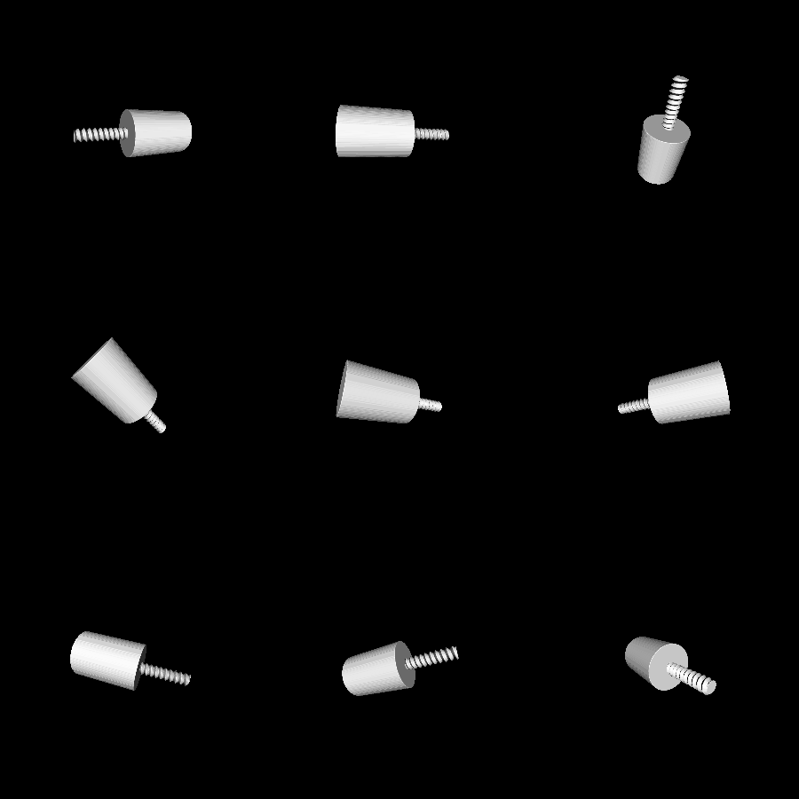

# drawer

This is a usable, printable shelf with three drawers. The shelf is 6x6x6 inches by default, which is big enough for some medium-sized tools. All models can be printed support free.

The shelf is made of four different 3D models:

 * A frame
 * A drawer to slide into the frame
 * A knob for the drawer
 * A nut to screw the knob into.

Typically, you would print three drawers, knobs, and nuts per frame.

# Renderings

Here is the frame. It has fancy cutouts which require less material than a solid frame:

Here is the drawer, designed to fit into the frame with a bit of slack:

The knob and nut are rather trivial:

