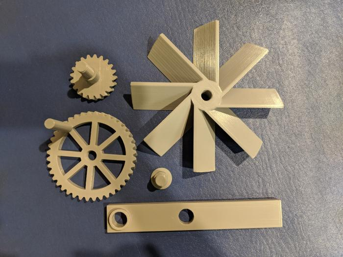
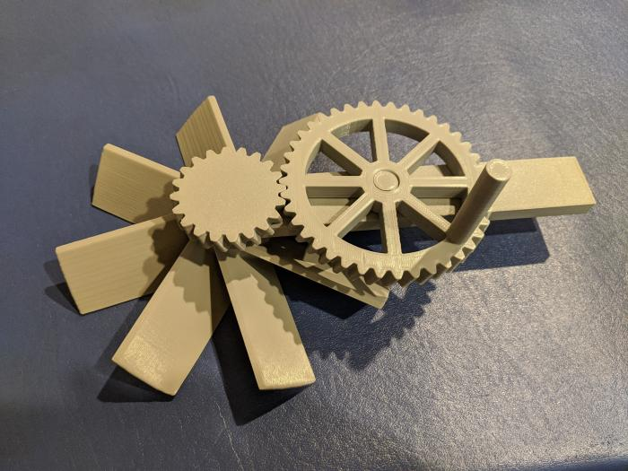

# fan

This is an assembly-required hand-crank fan. It is made out of a handful of parts which screw together. Each part can be printed support-free.

# Pictures

Here are the parts separately:

Here is the assembled product:

