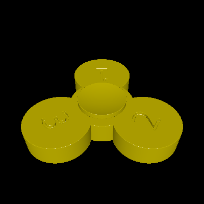

# fidget-spinner

This is a fidget spinner as a single interlocking part. It is intended to be printed using SLS or some other support-free method.

The `PartSpacing` constant can be modified to give the axle more clearance. The default setting (0.01 inches) may be too agressive for most printers.

# Rendering

