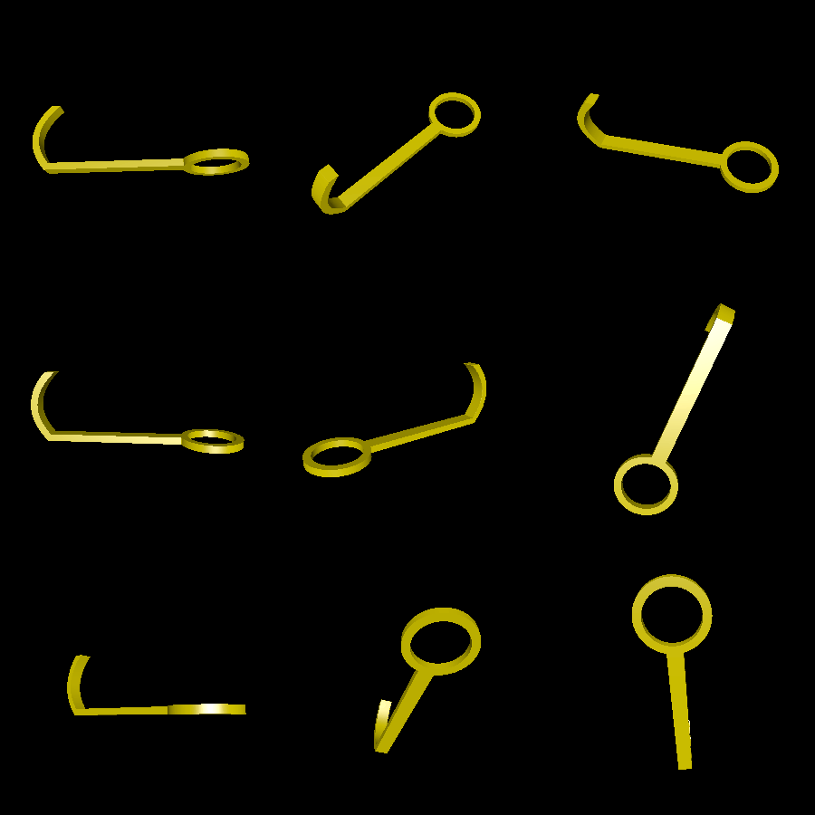
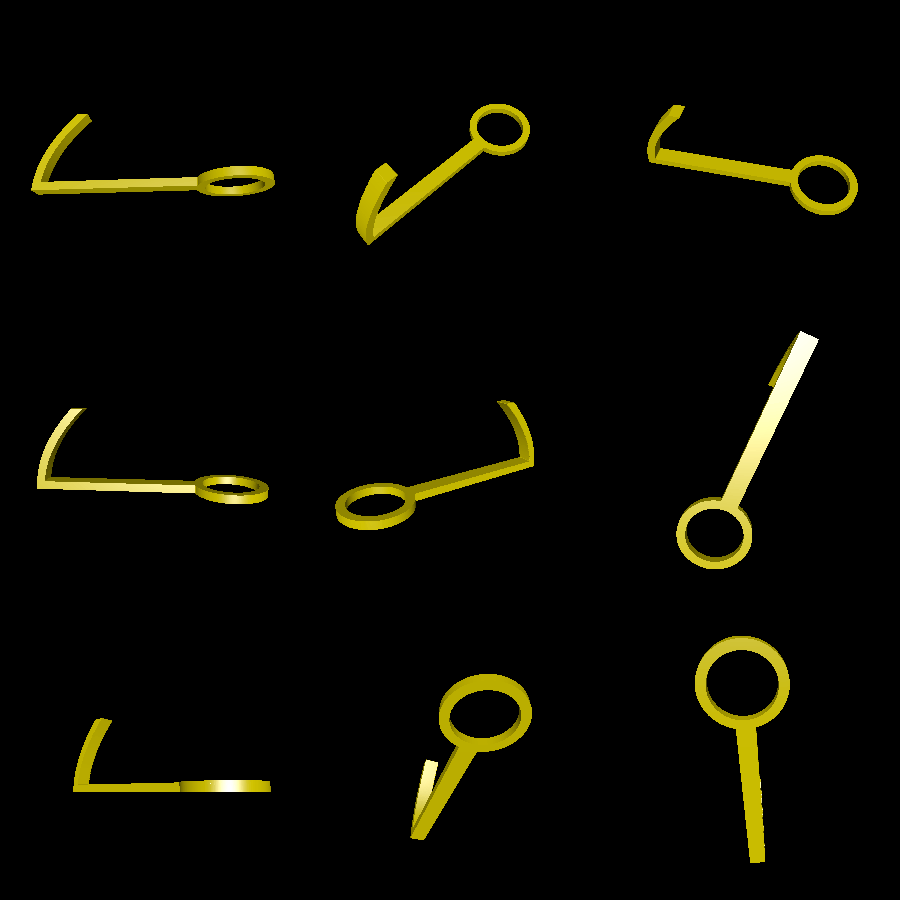

# hanging-hook

This is a printable hook that you can hang from another hook, for example to hang a collection of coats on top of each other. It has no overhangs greater than 45 degrees, so can be easily printed.

# Renderings

Here is the default hook, which has a dip (lowest point) in the middle of the hook:

Here is with the `-no-dip` flag, which removes the dip and allows more hooks to hang flush on this hook:

