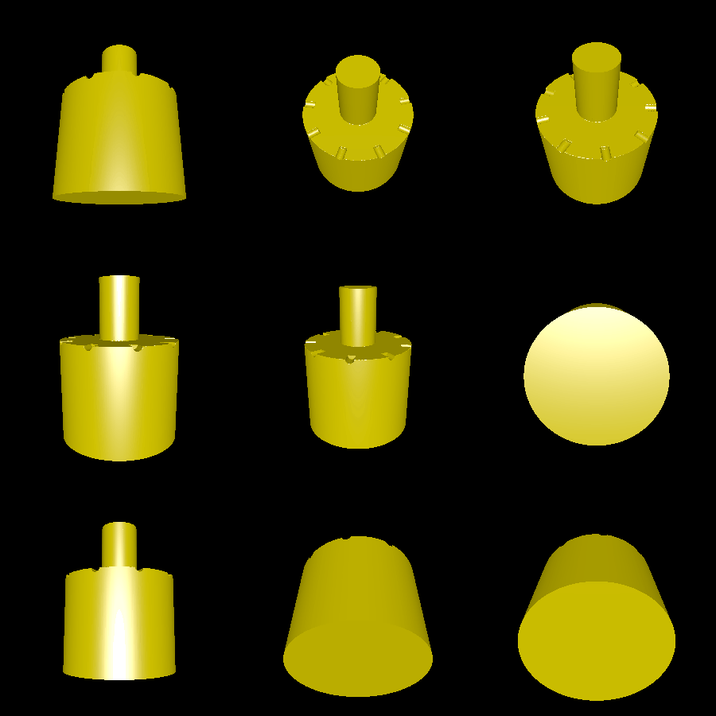

# hole_measure

This example creates a set of cylindrical pegs of different sizes. Each peg is marked using a number of notches to indicate its size. These pegs, if printed, can be helpful for measuring holes (e.g. for pegs to hold up a cabinet shelf).

# Rendering

Here is a rendering of the largest (default) peg, complete with its nine notches:

