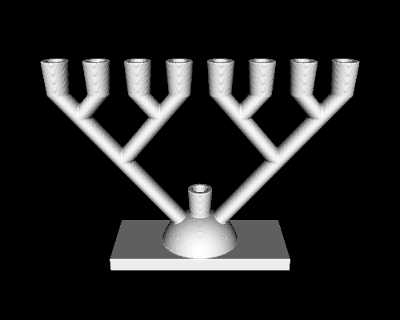

# menorah

This is a 3D model of a [Hanukkah](https://en.wikipedia.org/wiki/Hanukkah) [menorah](https://en.wikipedia.org/wiki/Menorah_(Hanukkah)). It is based on a binary tree pattern, where the root node and the leaf nodes contain candle holders.

The model is intended to be fully usable (with standard-sized candles). It is designed to be printable on a commodity FDM printer, although it is probably only safe to use if printed in a material that can withstand high temperatures.

