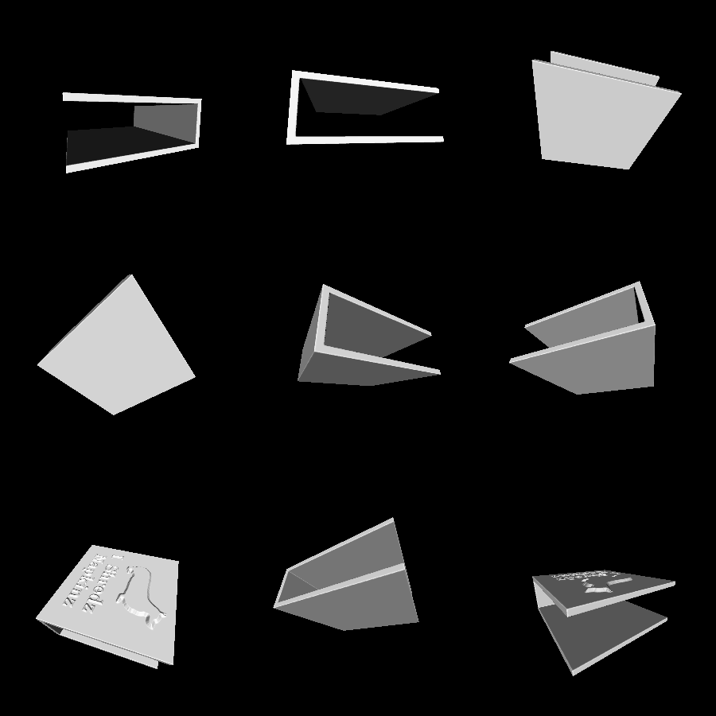

# napkin-holder

This is a 3D-printable napkin holder with an image popping out of the side. The image is stored in [image.png](image.png) and can be modified as one sees fit.

The image protrudes at a 45-degree angle so that it can be printed on an FDM printer without supports.

# Renderings

