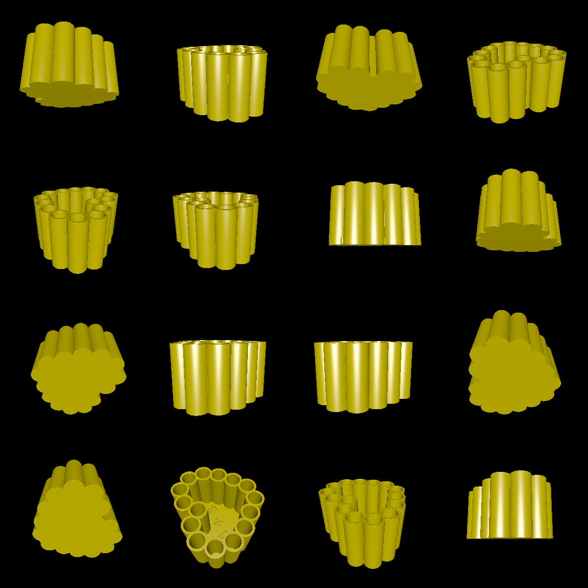

# Pencil Holder

This example shows how to make a heart-shaped pencil holder with an inscription in the middle. It dynamically calculates the perfect size so that the pencil holes meet up perfectly where they started. Printable with FDM, this design is affordable and useful.

