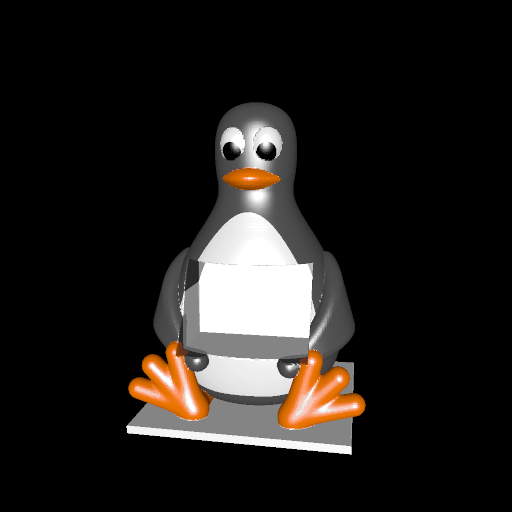
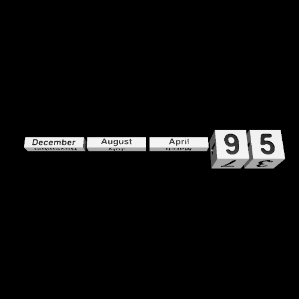

# penguin_calendar

This is a cartoonish 3D model of a penguin, with a whole cut out for blocks that can be arranged to tell the current month and day. The blocks are stored as a separate model, which can also be printed in color.

# Renderings

Here is the penguin itself:

Here are the blocks for indicating the date:

