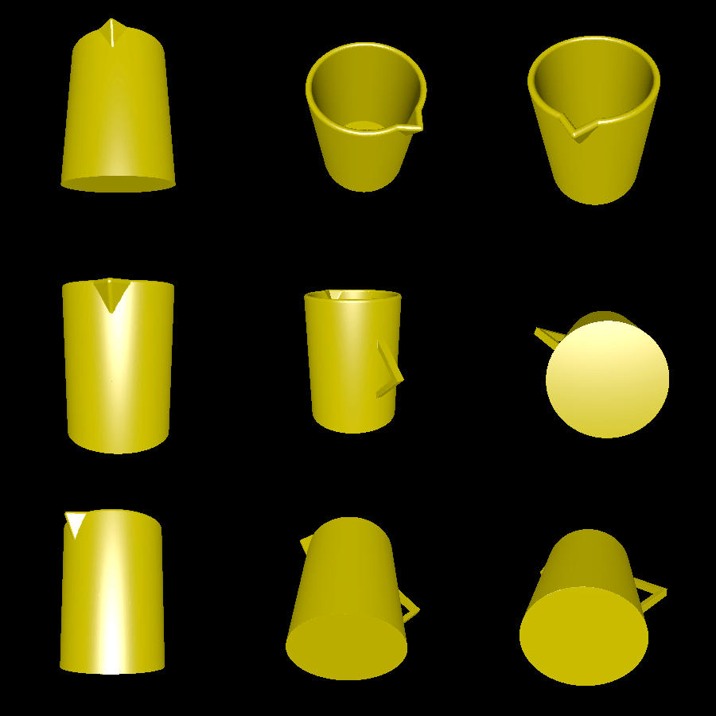

# pitcher

This example creates a water pitcher with a handle and a lip. It is fully 3D-printable without supports, and is intended for watering plants!

# Rendering

Here is what the model looks like:

