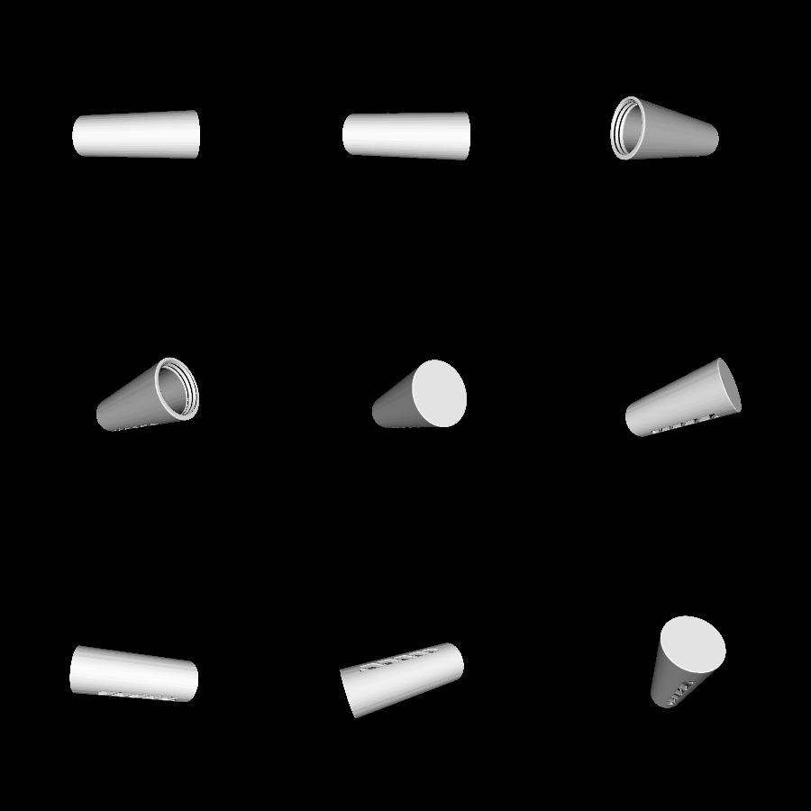
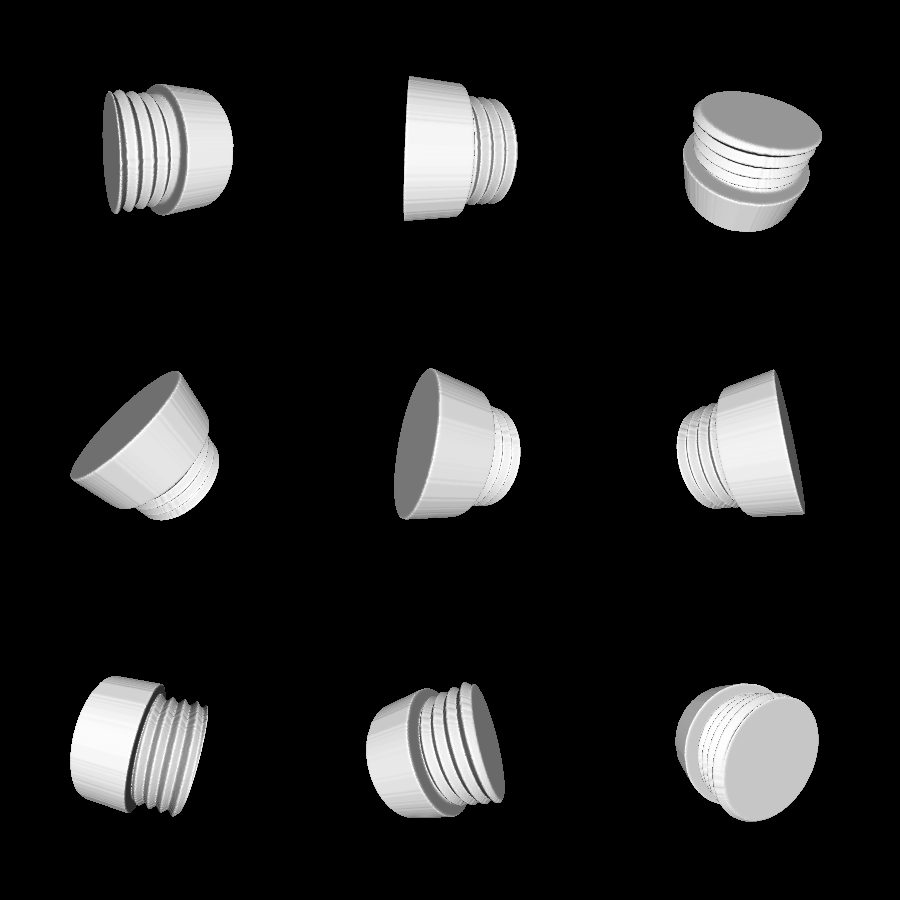

# quarter-case

This is a 3D printable container that can store quarters. It is intended to be filled with quarters and then kept in a car in order to pay parking meters.

The container is two pieces: a body and a lid. The body includes slits in the sides to see how many quarters you have left.

# Renderings

Here is the body:

Here is the lid:

