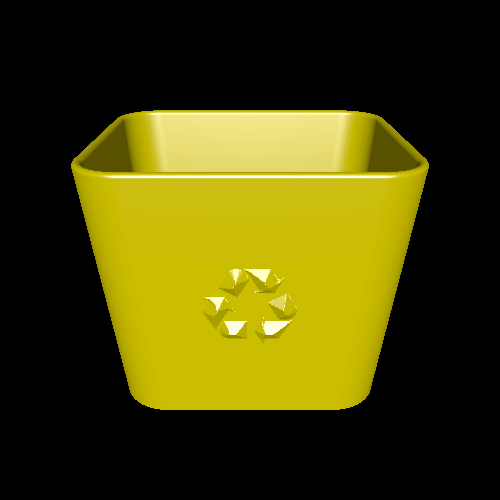

# recycle-bin

This example creates a 3D printable recycling bin with the international recycling symbol on the side. It features rounded edges and a rounded rim, which are implemented as part of the `Solid` rather than with mesh operations.

The generated model can be printed with no support structures, since the symbols on the sides are sloped rather than jutting directly out.

# Rendering

Here is a rendering of the produced model.

