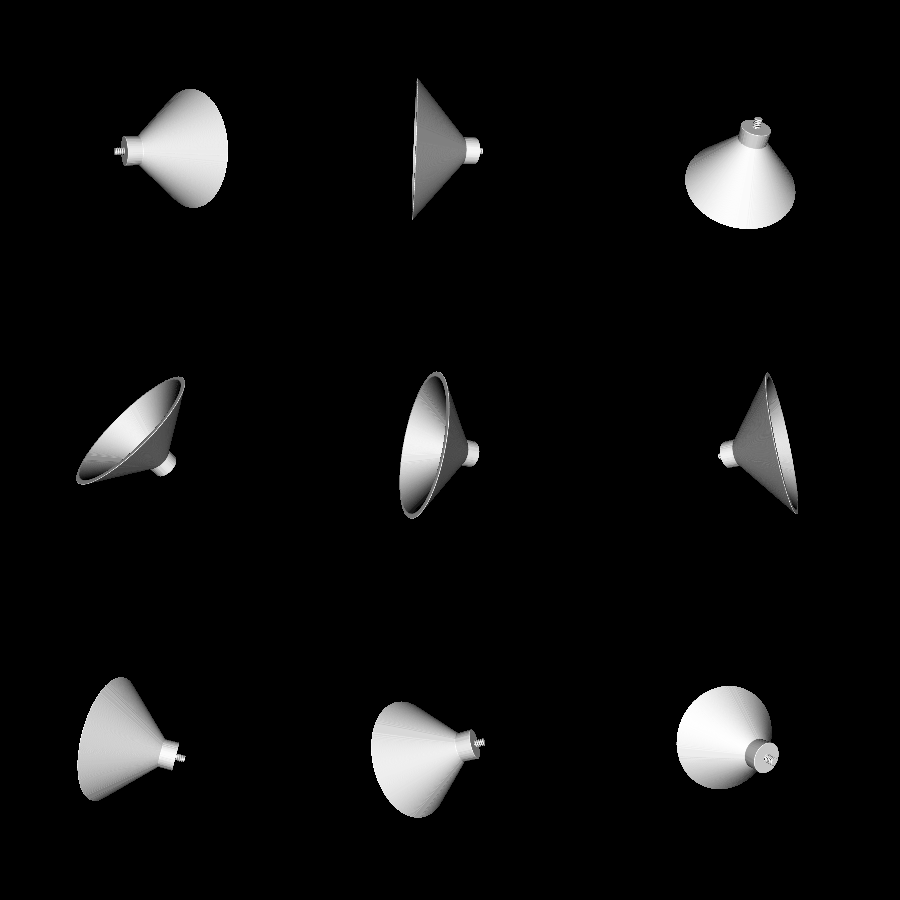
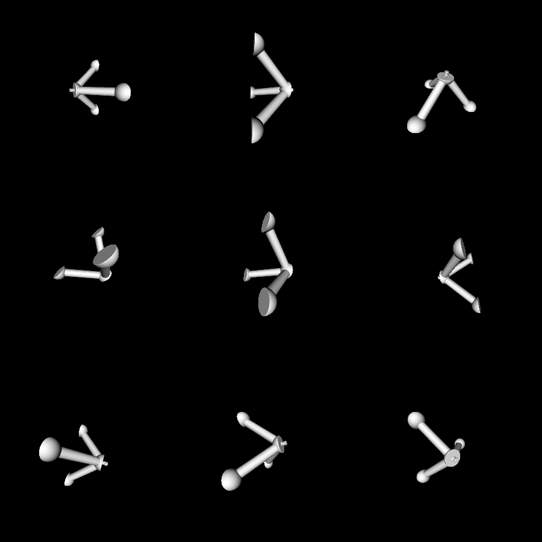
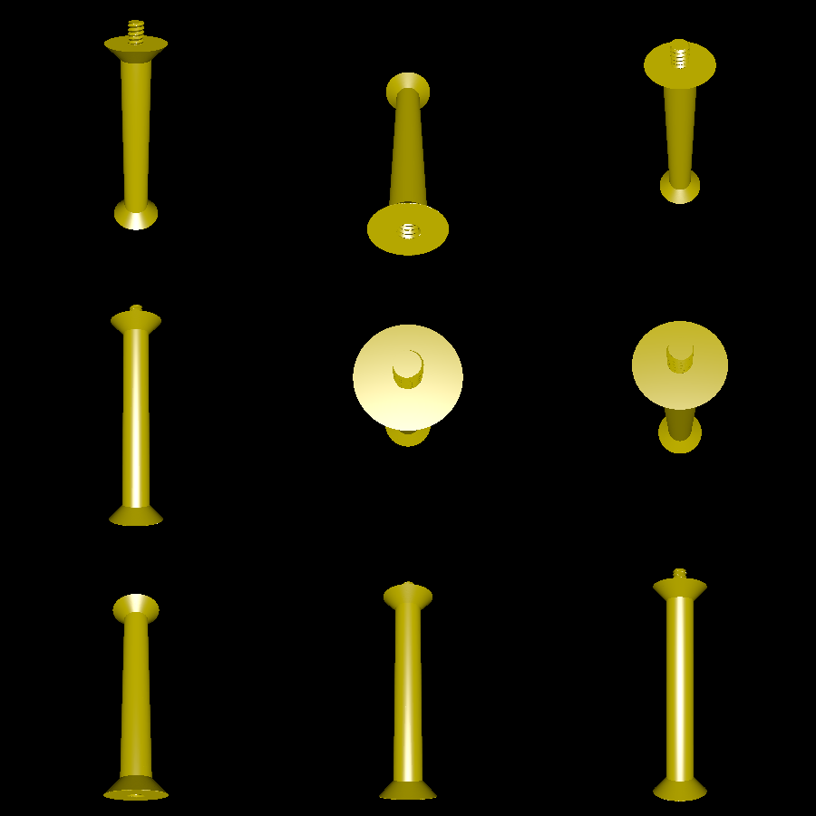
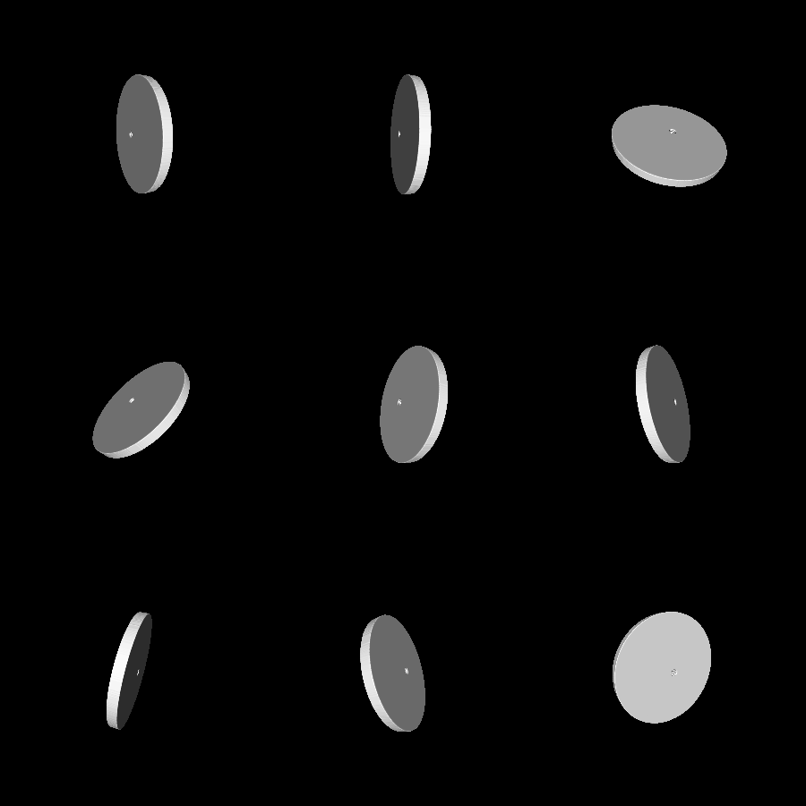

# table

This is a 3D-printable bedside table. It is modular, so more legs can be added to increase height, and different stands (bases) can be substituted in.

The table consists of three different types of parts: a stand, legs, and a top. There are currently two stand designs (one with three legs, and one which is just a cone). The legs can screw onto the stand, into each other, and into the top. Currently, the only top is a flat circle.

All parts are designed to have inclines of 45 degrees or less, making support-free printing possible.

# Renderings

The cone stand:

The original three-legged stand:

The leg part:

The top:

