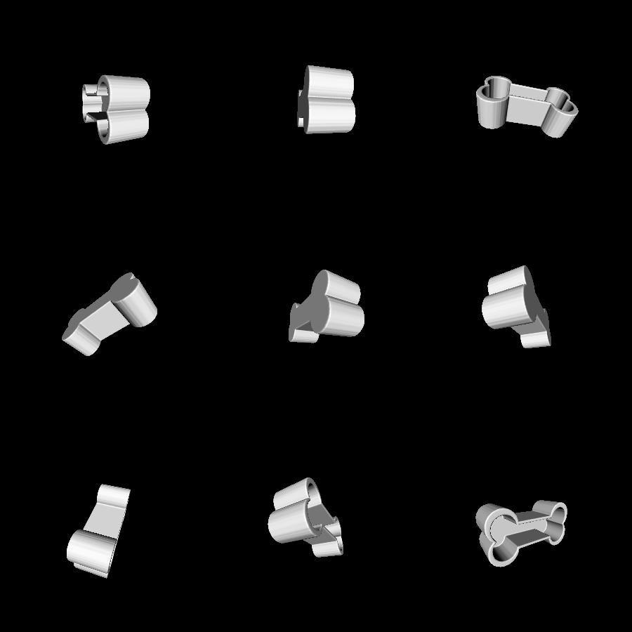
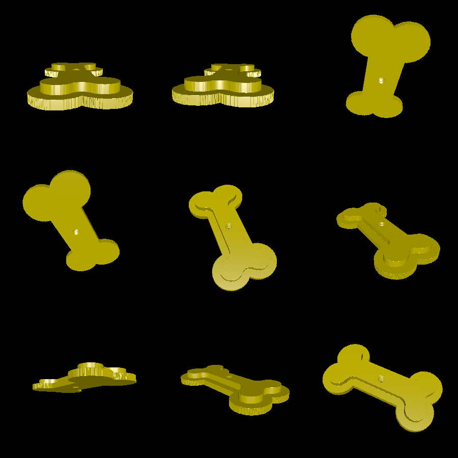
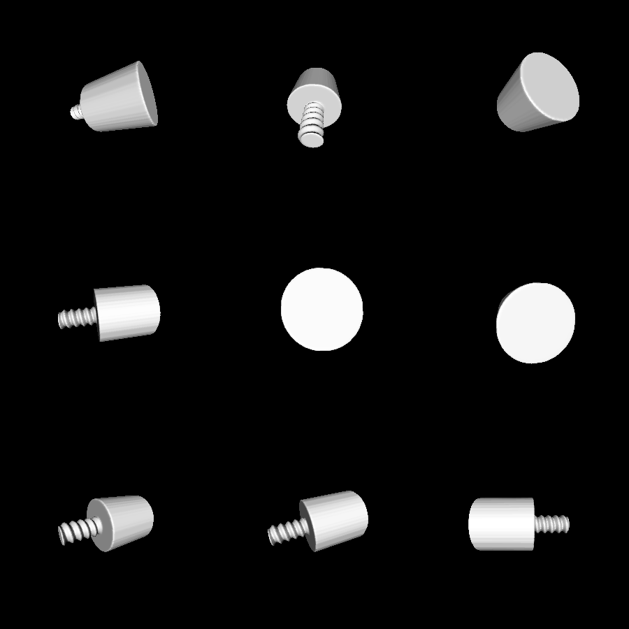

# treat-box

This is a 3D-printable box which is shaped like a dog bone. It is intended for storing small dog treats. The shape is derived from bone.png, and can be changed by changing bone.png to any other outline.

The box consists of three parts: the box itself, a lid, and a handle that screws into the lid.

# Renderings

Here is the box itsellf:

Here is the lid, note the screw hole:

Here is the handle which screws into the lid:

