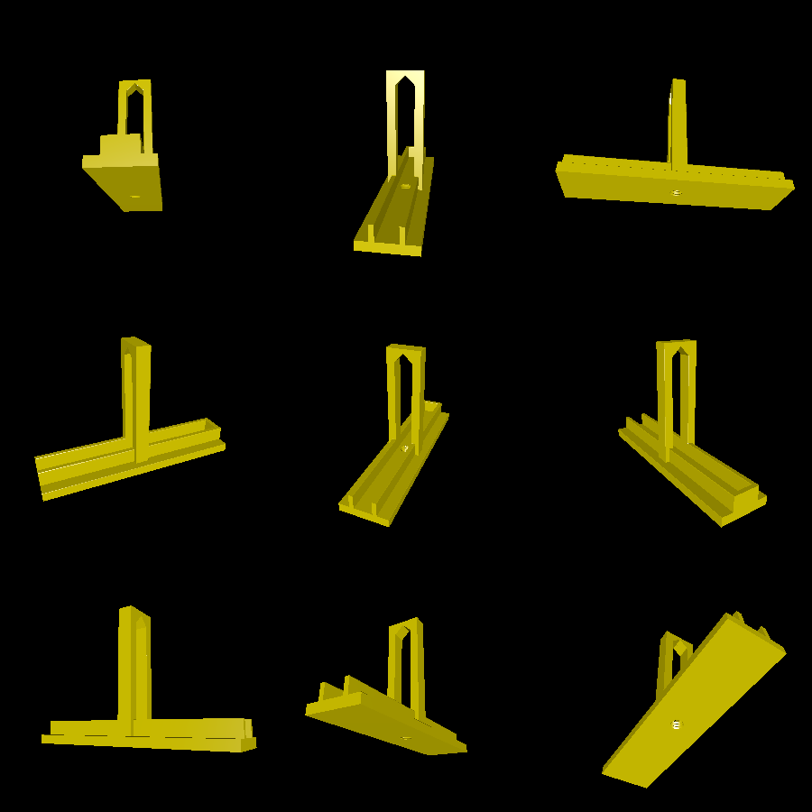
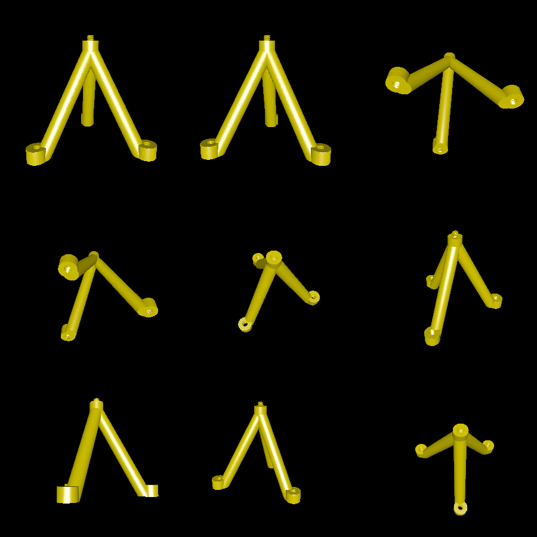
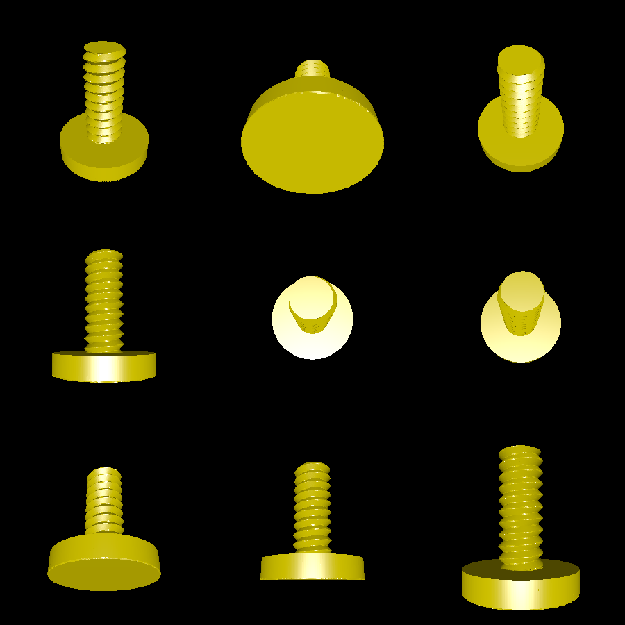

# tripod

This is a miniature smartphone tripod that is meant to be custom-printed to your phone's dimensions. It includes two (main) parts: a cradle and the tripod itself. The cradle can be swapped out, and is customized, while the tripod legs themselves are a fixed size.

The legs also include screw holes, which may be used to attach variable length extensions to change the height or incline of the tripod. The foot model that comes with this code is a small, screwable foot that can be adjusted by up to about an inch, allowing for changing the incline (but not really the height) of the tripod.

This program accepts CLI arguments to customize the dimensions of the phone cradle.

# Renderings

Here's a custom-fit cradle:

Here's the generic tripod legs:

Here's the foot:

