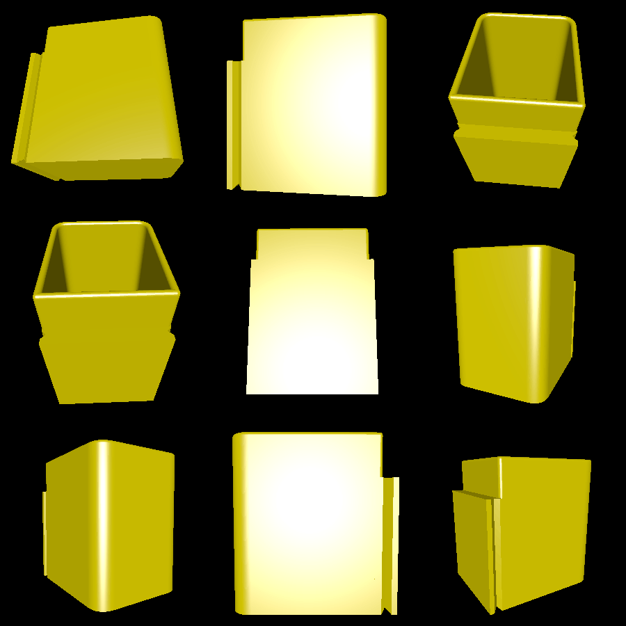

# wall_basket

For this example, I wanted a trash can to mount on the wall next to my drying machine so that I could conveniently throw out dryer sheets and lint. However, I couldn't stick this trash can directly to the wall, since I needed to periodically empty it into a larger trash can (and fishing out trash doesn't sound fun).

To achieve this, I created a mount that can be stuck to the wall that the trash can slides in and out of. This way, the trash can is usually hanging securely on the wall, but it can be lifted out of its mount and emptied.

# Renderings

Here is a rendering of the trash can:

Here is a rendering of the wall mount:

