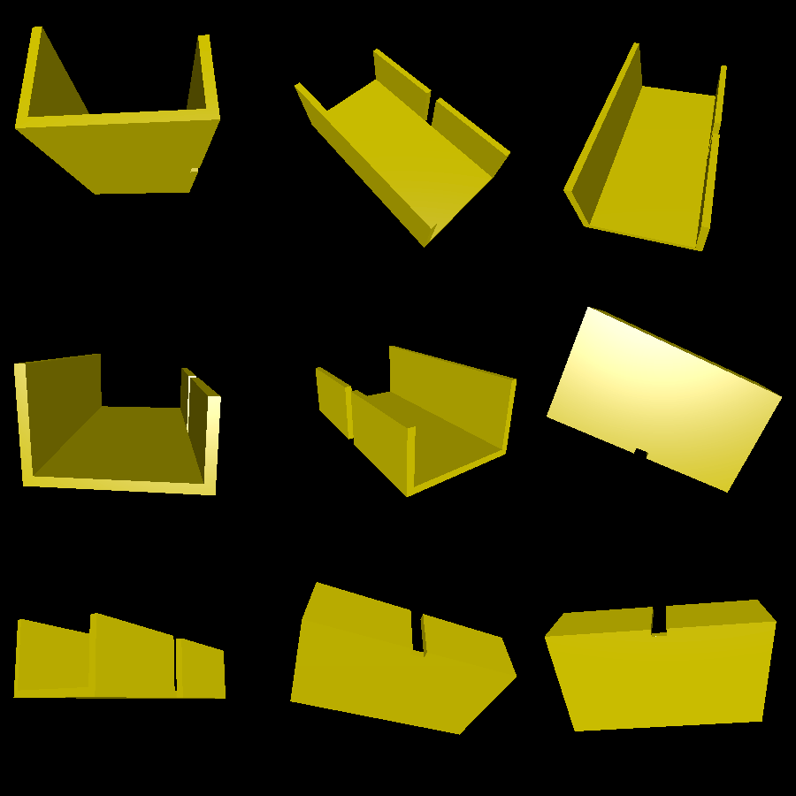

# watch_holder

This is a simple object that you can mount on a wall or a dresser to hold a smartwatch while it charges. It includes a small slit for a charger to reach in and go under the watch.

# Renderings

